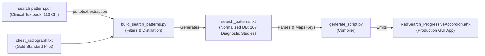

# RadSearch: Project Architecture, Clinical Rationale & Multi-Machine Guide

> **Authoritative Technical & Operational Reference**  
> **Repository:** `https://github.com/argrig666/search-pattern.git`  
> **Primary Runtime:** Windows / AutoHotkey v2 (Standalone or Portable)  
> **Ingestion & Compiler:** Python 3 (`poppler-utils` / `pdftotext`)  
> **Target Audience:** Radiologists, Clinical Engineers, and Autonomous AI Coding Agents.

---

## 1. Executive Summary & Clinical Rationale

### 1.1 The Clinical Problem in Diagnostic Radiology
Radiologists interpret hundreds of cross-sectional (CT, MRI) and projectional (radiographs, mammograms) studies during high-volume emergency and routine clinical shifts. Each examination presents thousands of anatomical structures across multiple planes and contrast phases. 

Diagnostic errors in radiology rarely stem from ignorance of disease appearance. Instead, they arise from cognitive failure modes:
1. **Satisfaction of Search (SOS):** Once an obvious finding is identified (e.g., an acute rib fracture), the visual search prematurely terminates, leaving secondary, potentially catastrophic findings unperceived (e.g., an apical pneumothorax, aortic contour irregularity, or a retrocardiac pulmonary nodule).
2. **Cognitive Tunneling & Fatigue:** High study volumes cause perceptual drift, leading to predictable misses in known anatomical blind spots (sternoclavicular joints, scout radiograph incidentals, visualized spinal canal on abdominal CT, bowel wall enhancement patterns).
3. **Inconsistent Systematic Traversal:** Without an accessible, structured anatomic framework, reading approaches vary from scan to scan.

### 1.2 The Technological Solution: RadSearch
**RadSearch** is an ultra-lightweight, ergonomic, distraction-free search pattern checklist engineered to sit alongside diagnostic PACS monitors (e.g., Barco, Eizo 3MP/5MP displays). It presents standardized, anatomical search patterns derived from clinical literature and provides rapid navigation without interrupting image interpretation.

### 1.3 Why AutoHotkey v2 on Windows PACS Workstations?
Clinical radiology reading rooms are dominated by Windows workstations connected to enterprise PACS systems (e.g., Sectra, GE Centricity/Universal Viewer, Agfa Enterprise Imaging, Philips IntelliSpace, Visage 7) and voice recognition software (Nuance PowerScribe 360/One, Philips SpeechMagic, 3M M*Modal).

1. **Zero-Install & Zero-Privilege Portable Execution:** Hospital PACS workstations are strictly locked down by institutional IT policies. Radiologists and clinical researchers cannot install runtimes like Node.js, Electron, or Python. AutoHotkey v2 can run entirely as a self-contained portable executable (`AutoHotkey64.exe`) from a flash drive or user directory without administrator privileges.
2. **Native Win32 Common Controls:** RadSearch utilizes native Win32 controls (`SysTreeView32`, `Edit`, `Button`) via AutoHotkey v2, yielding instantaneous rendering, sub-millisecond input response, and minuscule memory consumption (< 15 MB RAM).
3. **Zero-Focus-Theft Architecture:** Radiologists scroll through hundreds of CT/MRI slices per second using a high-precision mouse while dictating into a microphone. RadSearch provides background advancement hotkeys that update checklist state without stealing window focus away from the active PACS cine viewport or PowerScribe dictation field.

---

## 2. Core UX Principles & Invariants (Golden Rules)

Any agent or developer modifying RadSearch **MUST** adhere to the following design invariants:

### 🌟 Rule 1: Fully Expanded, Gaze-Available Search Pattern (Anti-Collapse)
* **Design Decision:** When a study is loaded, **every anatomical station and every sub-item is immediately and fully expanded**.
* **Rationale:** Traditional software accordions automatically collapse non-active sections when a new section opens. In radiology, **auto-collapsing is catastrophic to the reading workflow**. An accordion collapse hides upcoming anatomy from the radiologist’s peripheral vision, destroying their mental model of the organ system. All stations must remain permanently visible and gaze-available. Stations never auto-collapse.

### 🌟 Rule 2: Visual Greying-Out & Peripheral Progress Feedback
* **Design Decision:**
  * Active, uninspected items are rendered in crisp off-white (`#D8DEE9`).
  * Inspected items are checked off, prefixed with `✔`, and **greyed out** into muted dark slate (`#5C6370`).
  * Station drawers display dynamic completion tallies: `▾ 1. SCOUT & BONES (2/4)`.
  * When all children of a station are completed, the header turns soft sage green: `✔ 1. SCOUT & BONES (4/4)`.
  * An ultra-slim cyan accent progress bar at the top displays whole-study completion percentage.
* **Rationale:** The radiologist should be able to assess exam progress and verify that all blind spots were evaluated with a 100-millisecond glance.

### 🌟 Rule 3: Zero-Focus-Theft Integration (`Ctrl + Alt + Space`)
* **Design Decision:** RadSearch registers a global Windows hotkey (`Ctrl + Alt + Space`, or remappable to `F12` or dictation microphone buttons).
* **Rationale:** Pressing this hotkey checks off the current item and advances selection to the next uninspected leaf item **without bringing RadSearch to the foreground or stealing focus from PACS**. In PACS, window focus loss pauses cine playback and drops microphone input in speech recognition software.

### 🌟 Rule 4: Single-Keypress Mnemonic Drill-Down (Zero Typing)
* **Design Decision:** The catalog switcher requires zero free-form typing:
  * **Level 1 (Section):** 11 single keys (`[N]` Neuro, `[B]` Body, `[C]` Chest, `[M]` MSK, `[H]` Cardiac, `[U]` Ultrasound, `[P]` Pediatric, `[R]` Breast, `[X]` Nuclear Medicine, `[V]` Peripheral Vascular, `[W]` Workflow).
  * **Level 2 (Modality):** Single keys contextually mapped per section (`[C]` CT, `[M]` MRI, `[R]` Radiograph, `[U]` Ultrasound, `[F]` Fluoroscopy).
  * **Level 3 (Study):** Mnemonic single key (`[H]` Head, `[T]` Temporal, `[A]` Abdomen/Pelvis, `[P]` PE).
* **Example:** `N` ➔ `C` ➔ `H` instantly loads **CT HEAD**.
* **Navigation:** `Backspace` or `Left Arrow` steps back up a level. Pressing any Section key at any time immediately switches sections.

### 🌟 Rule 5: Diagnostic Dark-Room Palette & High-DPI Typography
* **Design Decision:**
  * Background: `#181A1F` (Dark slate)
  * Elevated panels: `#21252B`
  * Active text: `#D8DEE9`
  * Muted text: `#5C6370`
  * Medical cyan accent: `#61AFEF`
  * Success green: `#98C379`
  * Font: 12pt Segoe UI with 30px line height (`TVM_SETITEMHEIGHT` = `0x111B`).
* **Rationale:** Radiologists read in low ambient lighting (10–25 lux) to optimize retinal sensitivity to subtle tissue density differentials. Standard bright UI elements ruin dark adaptation. Text must be easily legible from 2.5 to 3 feet away without eye strain.

---

## 3. Codebase Architecture & File Inventory

```text
/home/argrig/Projects/Search Pattern/
├── search pattern.pdf                 # Primary clinical source textbook (375 pages, 113 chapters)
├── chest_radiograph.txt               # Gold-standard reference pilot checklist (CXR)
├── build_search_patterns.py           # Ingestion pipeline: extracts & cleans PDF into structured text
├── search_patterns.txt                # Compiled clinical database (107 diagnostic studies, 4,944 lines)
├── generate_script.py                 # Compiler: analyzes keymaps & generates production AHK app
├── RadSearch_ProgressiveAccordion.ahk # Production standalone AutoHotkey v2 application
├── README_RadSearch.md                # Quick-reference cheatsheet & end-user instructions
├── PROJECT_GUIDE.md                   # This comprehensive architecture & synchronization specification
├── README.md                          # Repository landing page linking documentation
├── Run_RadSearch.bat                  # One-click Windows runner (detects installed or portable AHK)
└── sync_and_run.bat                   # One-click Windows git-sync and launcher script
```

### Detailed File Roles:

| File | Language / Type | Role & Responsibilities |
| :--- | :--- | :--- |
| [`search pattern.pdf`](file:///home/argrig/Projects/Search%20Pattern/search%20pattern.pdf) | PDF Binary (~29 MB) | Authoritative clinical source containing search patterns across 10 radiology subspecialties. |
| [`chest_radiograph.txt`](file:///home/argrig/Projects/Search%20Pattern/chest_radiograph.txt) | UTF-8 Text | Hand-curated, gold-standard search pattern for Chest Radiograph used to establish high-yield formatting. |
| [`build_search_patterns.py`](file:///home/argrig/Projects/Search%20Pattern/build_search_patterns.py) | Python 3 | Ingestion engine. Parses `search pattern.pdf` using `pdftotext`, removes meta/rhetorical filler, distills telegraphic anatomical items, and writes `search_patterns.txt`. |
| [`search_patterns.txt`](file:///home/argrig/Projects/Search%20Pattern/search_patterns.txt) | UTF-8 Text | Normalized hierarchical checklist database loaded by RadSearch at runtime. |
| [`generate_script.py`](file:///home/argrig/Projects/Search%20Pattern/generate_script.py) | Python 3 | Compiler script. Reads `search_patterns.txt`, generates non-conflicting single-key mnemonic maps for all 107 diagnostic studies, and emits `RadSearch_ProgressiveAccordion.ahk`. |
| [`RadSearch_ProgressiveAccordion.ahk`](file:///home/argrig/Projects/Search%20Pattern/RadSearch_ProgressiveAccordion.ahk) | AutoHotkey v2 | Standalone GUI application. Implements dark-mode Win32 TreeViews, zero-focus hotkeys, fuzzy search, and progress tracking. |
| [`README_RadSearch.md`](file:///home/argrig/Projects/Search%20Pattern/README_RadSearch.md) | Markdown | End-user quick reference: keyboard shortcut tables, PACS setup tips, and microphone mapping. |

---

## 4. Ingestion & Build Pipeline Details

The system follows a three-stage build pipeline:



### 4.1 Stage 1: Extraction & Filtering (`build_search_patterns.py`)
`build_search_patterns.py` reads `search pattern.pdf` and normalizes the clinical text:
1. **TOC Parsing & Page Mapping (`get_study_list`):** Scans the Table of Contents (pages 10–15) to identify Section, Modality, Study Title, and start pages. Resolves deviations via `MANUAL_MAP`. (Note: The textbook's 6 workflow optimization chapters are excluded from the checklist database, leaving 107 pure diagnostic anatomical search patterns).
2. **Meta-Content Elimination (`META_PATTERNS` & `SUBITEM_META_PATTERNS`):** Strips non-anatomical sections such as:
   - Clinical indications, patient history, and comparison with priors.
   - Acquisition technique, contrast timing, and study limitations.
   - Billing codes and proofreading/report sign-off instructions.
   *Rationale:* A search pattern is an anatomical inspection checklist, not an administrative or dictation macro.
3. **Rhetorical Filler Stripping (`RHETORICAL_PATTERNS`):** Filters conversational book text ("keep in mind that", "it is useful to know", "blind spots are central").
4. **Telegraphic Distillation (`clean_telegraphic`):** Strips conversational prefixes ("look at the...", "assess for presence of...", "make sure that there is no...") to produce crisp, actionable medical nouns.
5. **Atomic Item Decomposition (`split_atoms`):** Separates compound sentence structures (e.g. `Facial bones: ZMC, NOE, orbit floor`) into distinct, checkable checklist leaves.
6. **Hierarchy Construction:** Formats clean numeric hierarchy:
   ```text
   SECTION > MODALITY > STUDY_TITLE
   1. Primary Station
   1.1 Secondary Station
   1.1.1 Atomic Anatomical Target
   ```

### 4.2 Stage 2: Code Generation & Keymap Compilation (`generate_script.py`)
`generate_script.py` takes `search_patterns.txt` and compiles the complete AutoHotkey v2 application:
1. **Mnemonic Mapping:** Reads all 107 diagnostic studies and constructs conflict-free mnemonic lookups:
   - `SectionKeyToName`: Map of single characters to 11 top-level sections.
   - `ModalityKeyMap`: Map of section-scoped characters to modalities.
   - `StudyKeyMap`: Map of `Section|Modality` pairs to studies.
2. **Template Injection:** Injects generated keymaps into the Win32 GUI template containing:
   - Immersive dark mode styling (`DWMWA_USE_IMMERSIVE_DARK_MODE`).
   - Win32 custom draw message handlers (`NM_CUSTOMDRAW`, `CDDS_ITEMPREPAINT`) for custom row colors.
   - Zero-focus background hotkey engine (`AdvanceChecklist()`).
   - Fuzzy search and dual-mode state machine (`Catalog` vs `Checklist`).
3. **Emits:** `RadSearch_ProgressiveAccordion.ahk`.

---

## 5. Multi-Machine Synchronization Guide

To maintain and run RadSearch across different environments (Linux development workstation, personal laptops, hospital Windows PACS reading stations), follow these procedures.

### 5.1 Machine Topology
* **Machine A (Development / Source):** Linux or macOS workstation where Python scripts, Git, and PDF parsing occur.
* **Machine B, C, D (Diagnostic PACS Stations):** Windows 10/11 reading room workstations where `RadSearch_ProgressiveAccordion.ahk` runs alongside PACS.

```mermaid
flowchart TD
    subgraph DevMachine["Machine A: Linux Dev / Git Origin"]
        GitRepo["Git Repository<br>(main branch)"]
        PyBuild["build_search_patterns.py<br>generate_script.py"]
    end

    subgraph GitHubRemote["GitHub Remote"]
        GitHub["origin: argrig666/search-pattern.git"]
    end

    subgraph WinPACS["Machines B, C: Windows Diagnostic Workstations"]
        GitPull["Git Clone / Pull<br>(or Cloud Sync / Network Share)"]
        Runtime["Runtime Engine:<br>RadSearch_ProgressiveAccordion.ahk<br>+ search_patterns.txt"]
        AHK["AutoHotkey v2<br>(Installed or Portable AutoHotkey64.exe)"]
        PACS["Diagnostic PACS & PowerScribe"]
    end

    GitRepo -->|git push| GitHub
    GitHub -->|git pull| GitPull
    GitPull --> Runtime
    Runtime <--> AHK
    AHK -.->|Ctrl+Alt+Space (Zero-Focus)| PACS
```

---

### 5.2 Synchronization Workflows

#### Method 1: Git Synchronization (Primary & Recommended)
The authoritative remote repository is:
```text
https://github.com/argrig666/search-pattern.git
```

1. **Pushing updates from the development machine:**
   ```bash
   cd "/home/argrig/Projects/Search Pattern"
   git status
   git add .
   git commit -m "Update search patterns and UI improvements"
   git push origin main
   ```

2. **Pulling updates on a target machine:**
   ```bash
   cd "C:\path\to\Search Pattern"
   git pull origin main
   ```

3. **Initial setup on a new machine:**
   ```bash
   git clone https://github.com/argrig666/search-pattern.git
   ```
   > [!TIP]
   > **Bandwidth Tip:** `search pattern.pdf` is ~29 MB. If cloning over a slow cellular hotspot or restricted hospital VPN, use a shallow clone:
   > ```bash
   > git clone --depth 1 https://github.com/argrig666/search-pattern.git
   > ```

---

#### Method 2: Zero-Install Portable USB / Local Folder Deployment (No Admin Rights)
Most hospital reading stations prevent software installation or accessing GitHub directly.

1. **Prepare Portable AutoHotkey v2:**
   - Download the official portable zip: [https://www.autohotkey.com/download/ahk-v2.zip](https://www.autohotkey.com/download/ahk-v2.zip).
   - Extract `AutoHotkey64.exe` directly into the project folder alongside `RadSearch_ProgressiveAccordion.ahk`.
2. **Transfer to PACS Machine:**
   - Copy the folder to a USB drive or your personal network user share (e.g. `H:\RadSearch` or `C:\Users\<username>\RadSearch`).
3. **Launch via `Run_RadSearch.bat`:**
   - Double-click [`Run_RadSearch.bat`](file:///home/argrig/Projects/Search%20Pattern/Run_RadSearch.bat).
   - The batch script automatically detects if `AutoHotkey64.exe` is present in the folder, or if AutoHotkey v2 is installed in `Program Files`. It launches the app with zero installation prompts.

---

#### Method 3: Cloud Drive / Shared Network Folder Sync (Dropbox, OneDrive, Nextcloud, Syncthing, SMB)
If your workstations share a secure clinical network drive or cloud folder:
1. Only **two runtime files** are required to run RadSearch on any Windows PC:
   - `RadSearch_ProgressiveAccordion.ahk`
   - `search_patterns.txt`
2. Sync this folder across machines via OneDrive, Nextcloud, or an SMB file share (`\\clinical-share\radiology\RadSearch`).
3. Whenever `generate_script.py` is re-run on your dev machine, copy the updated `.ahk` and `.txt` files into the synced folder. All reading stations update automatically.

---

#### Method 4: Automated One-Click Sync & Run (`sync_and_run.bat`)
On Windows workstations with Git installed, double-click [`sync_and_run.bat`](file:///home/argrig/Projects/Search%20Pattern/sync_and_run.bat). It will:
1. Execute `git pull origin main`.
2. Automatically start or reload `RadSearch_ProgressiveAccordion.ahk`.

---

## 6. Playbook for Future AI Agents & Developers

When another agent approaches this codebase, follow these precise guidelines for common tasks:

### Scenario A: Modifying an Existing Search Pattern
1. Open [`search_patterns.txt`](file:///home/argrig/Projects/Search%20Pattern/search_patterns.txt).
2. Locate the study header: `SECTION > MODALITY > STUDY_TITLE`.
3. Add, edit, or reorder checklist lines using the standard numeric hierarchy (`1.`, `1.1`, `1.1.1`).
4. Re-run the compiler to verify keymaps:
   ```bash
   python3 generate_script.py
   ```
5. Commit and push changes:
   ```bash
   git add search_patterns.txt RadSearch_ProgressiveAccordion.ahk
   git commit -m "Refine checklist items for [STUDY NAME]"
   git push origin main
   ```

### Scenario B: Adding a New Study or Updating PDF Ingestion
1. If modifying the source ingestion logic, edit [`build_search_patterns.py`](file:///home/argrig/Projects/Search%20Pattern/build_search_patterns.py).
2. Run the parser:
   ```bash
   python3 build_search_patterns.py
   ```
3. Verify that `search_patterns.txt` was updated with the expected study count.
4. If adding a new study, check [`generate_script.py`](file:///home/argrig/Projects/Search%20Pattern/generate_script.py) to assign an ergonomic, non-conflicting single key under `study_keys`.
5. Run:
   ```bash
   python3 generate_script.py
   ```
6. Verify no key collisions exist in the generated script.

### Scenario C: Modifying Keyboard Shortcuts & Dictation Hardware Mapping
To change the background advance hotkey (e.g. mapping to `F12`, `F8`, or a specific foot pedal signal):
1. In [`generate_script.py`](file:///home/argrig/Projects/Search%20Pattern/generate_script.py), locate the bottom hotkey definition (around line 1240):
   ```autohotkey
   ^!Space::
   {
       AdvanceChecklist()
   }
   ```
2. Add your desired hotkey (e.g., `F12::AdvanceChecklist()`).
3. Re-run `python3 generate_script.py`.

### Scenario D: Modifying GUI Appearance, Colors, or Typography
1. Open [`generate_script.py`](file:///home/argrig/Projects/Search%20Pattern/generate_script.py).
2. Locate the `Visual Palette` definitions in the `template` string (lines ~163–177):
   - `COLOR_BG`, `COLOR_PANEL`, `COLOR_TEXT_ACTIVE`, `COLOR_TEXT_MUTED`, `COLOR_ACCENT`, `COLOR_DONE`.
   - Update corresponding Win32 BGR constants (`BGR_MUTED`, `BGR_ACTIVE`, `BGR_TEXT`, `BGR_DONE`).
3. Adjust line heights or font size in `template` (e.g. `TVM_SETITEMHEIGHT`, `SetFont`).
4. Re-run `python3 generate_script.py`.

---

## 7. Operational Verification Commands

Always run these commands before committing or deploying changes:

```bash
# 1. Verify compiler runs cleanly
python3 generate_script.py

# 2. Verify line count and study integrity
python3 -c "
with open('search_patterns.txt') as f:
    headers = [l for l in f if ' > ' in l and not l.strip().startswith(('1','2','3','4','5','6','7','8','9'))]
print(f'Total Diagnostic Studies: {len(headers)}')
assert len(headers) == 107, f'Expected 107 studies, found {len(headers)}'
print('Checklist database integrity verified (107 diagnostic search patterns)!')
"

# 3. Check git status
git status
```

---
*RadSearch is maintained with zero external runtime dependencies to ensure resilience across enterprise healthcare PACS environments.*
